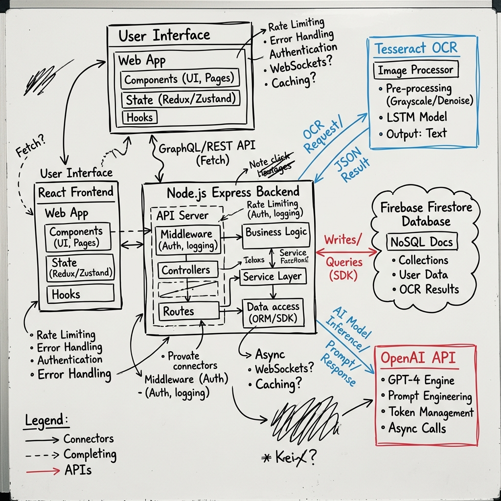
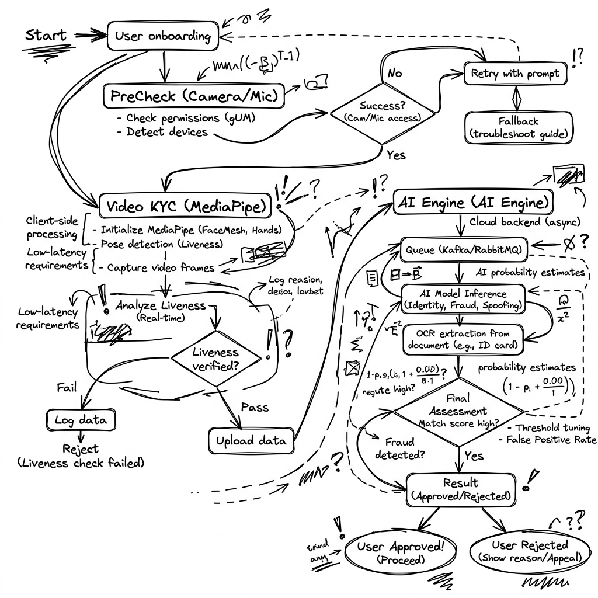

# 🚀 LoanIQ

### Enterprise AI-Powered Loan Origination Infrastructure

  Intelligent digital lending infrastructure combining biometric identity verification, AI-powered credit intelligence, automated underwriting workflows, and real-time operational orchestration.

  

 

 

---

# 📌 Executive Summary

**LoanIQ** is an enterprise-grade digital lending platform engineered to modernize loan origination and verification workflows using artificial intelligence, biometric validation, OCR-based identity extraction, and intelligent credit risk analysis.

The platform eliminates traditional manual underwriting bottlenecks by introducing:

* AI-assisted applicant profiling
* Real-time biometric liveness verification
* Automated PAN extraction and validation
* Intelligent sanction processing
* Live operational monitoring
* Secure document generation workflows

LoanIQ is designed with a fintech-first architecture focused on scalability, automation, fraud prevention, and seamless customer onboarding.

---

# 🏗️ Lending Workflow Architecture

---

# ✨ Core Platform Modules

## 🔐 Digital Identity Verification Engine

LoanIQ integrates a multi-layered identity validation workflow that strengthens onboarding security and reduces fraudulent applications.

### Key Capabilities

* Real-time biometric liveness detection
* Facial movement validation pipeline
* PAN card OCR extraction engine
* **IP-Blocking Fraud Limiter:** Actively tracks and blocks IPs that repeatedly upload blurry/fake documents to prevent OCR spam.
* Identity cross-verification workflows
* Fraud-resistant onboarding architecture

---

## 🧠 AI Credit Intelligence Layer

The AI evaluation engine automates applicant analysis using NLP-driven financial interpretation and intelligent decision modeling.

### AI Features

* NLP-based transcript analysis
* Intelligent applicant risk profiling
* Automated credit scoring logic
* **Explainable AI Audit Trail:** Every AI decision is fully transparent, providing a JSON breakdown of exact score deductions and reasoning to ensure the AI is not a "black box".
* Financial behavior interpretation
* Decision support analytics

---

## 📊 Real-Time Operational Control

The platform provides centralized operational visibility through a live administrative ecosystem powered by Firebase synchronization.

### Operational Features

* Real-time application monitoring
* Live approval workflow tracking
* Dynamic loan status management
* Instant backend synchronization
* Centralized admin operations dashboard

---

## 💳 Razorpay EMI & Disbursement Integration (Razorpay AI Buildathon)

LoanIQ is fully integrated with the official **Razorpay Node SDK** to handle post-sanction disbursements and EMI collections seamlessly.

### Payments Capabilities

* **Live Razorpay API Integration:** Generates official, live EMI payment links immediately upon admin disbursement.
* **Agentic Commerce Ready:** The platform is designed to be fully transactable by AI agents for automated revenue recovery.
* **Graceful Failure Routing:** If OCR systems or external services fail, the system elegantly routes to `MANUAL_REVIEW_REQUIRED` and triggers security logging instead of crashing.
* **Test Mode API Support:** Fully supports Razorpay test keys for immediate deployment and testing.

---

## 🚪 Role-Based Access & Authentication

LoanIQ strictly separates entry points and routes for different roles to ensure high security and specialized workflows.

* **User (Applicant) Portal:**
  * **Dashboard URL:** [https://loan-iq-ai.vercel.app/user/dashboard](https://loan-iq-ai.vercel.app/user/dashboard) 
  * **Login/Signup:** [https://loan-iq-ai.vercel.app/user/auth](https://loan-iq-ai.vercel.app/user/auth)
  * **Permissions:** Apply for loans, complete OCR/Liveness checks, track application status, download sanction letters, and manage profile.

* **Loan Officer Portal:**
  * **Dashboard URL:** [https://loan-iq-ai.vercel.app/loan-officer/dashboard](https://loan-iq-ai.vercel.app/loan-officer/dashboard)
  * **Login:** [https://loan-iq-ai.vercel.app/loan-officer/login](https://loan-iq-ai.vercel.app/loan-officer/login)
  * **Permissions:** Review applications, verify KYC documents, assess risk, and approve/reject applications conditionally before final admin sanctioning.

* **Admin Portal:**
  * **Dashboard URL:** [https://loan-iq-ai.vercel.app/admin/dashboard](https://loan-iq-ai.vercel.app/admin/dashboard) 
  * **Login:** [https://loan-iq-ai.vercel.app/admin/login](https://loan-iq-ai.vercel.app/admin/login)
  * **Permissions:** Full system access. Manage users and loan officers, perform final disbursements, view platform analytics, and configure system settings.

### Security Features
* **Strict Route Separation:** Users, Officers, and Admins have completely separated login flows and protected routes.
* **Context-Aware Guards:** Ensures unauthorized users or cross-role logins are immediately rejected or redirected.
* **Seamless Upgrades:** Auto-conversion of guest applicants to registered users without losing application state.

---

## 📄 Automated Document Infrastructure

LoanIQ digitizes sanction and approval workflows using automated PDF generation and secure verification mechanisms.

### Documentation Features

* Dynamic PDF Sanction Letter generation for Admins
* Application Review & KYC PDF generation for Loan Officers
* QR-enabled document validation
* Automated approval documentation
* Secure, client-side digital-first rendering (jsPDF)
* **Secure Cloud Storage:** Powered by [Cloudinary](https://cloudinary.com) for fast, free, and robust storage of user identity documents and loan applications.

---

## 👤 Profile & Access Management

LoanIQ includes comprehensive, cross-role profile management ensuring that all ecosystem participants can securely update their information.

### Core Features

* **Role-Specific Dashboards:** Custom profile view for Applicants, Loan Officers, and Admins.
* **Persistent Data Synchronization:** Direct integration with Firebase to ensure edited profiles persist across sessions.
* **Secure Password Updates:** Standalone password modification flow equipped with client-side validation and backend bcrypt hashing.
* **Admin Oversight:** Admins maintain the ability to modify user profiles or update staff records directly from the executive dashboard.

---

## 🔔 Real-Time Notification System

A comprehensive notification ecosystem ensuring all parties stay informed of application updates instantaneously.

### Notification Features

* **Applicant Notifications:** Receive alerts on approval, rejection, and final disbursement.
* **Loan Officer Alerts:** Real-time updates when an application is sent back by Admin for further review.
* **Admin Alerts:** Instant pings when Loan Officers approve applications for final sanctioning.
* **Tech Stack:** Powered directly by Firebase Firestore for zero-latency messaging.

---

# ⚙️ System Architecture

| Infrastructure Layer      | Technology Stack                                 |
| ------------------------- | ------------------------------------------------ |
| Frontend Platform         | React 18, TypeScript, TailwindCSS, Vite          |
| Backend Services          | Node.js, Express.js                              |
| Realtime Database         | Firebase Firestore                               |
| AI Processing Layer       | NLP Engine, OCR Services, Biometric Verification |
| Document Engine           | jsPDF, QR Verification                           |
| Cloud Storage             | [Cloudinary](https://cloudinary.com/)            |
| Deployment Infrastructure | Vercel, Render                                   |

---

# 🎯 Business Vision

LoanIQ is built to redefine digital lending by transforming slow and manual verification systems into a fully automated AI-powered origination ecosystem.

The platform focuses on:

* Accelerating loan approvals
* Reducing operational overhead
* Strengthening fraud prevention
* Improving onboarding efficiency
* Enabling scalable fintech infrastructure

---

# 👨‍💻 Development Team

### Team CodeStorm

Built for the **Razorpay AI Buildathon** (Track 02: AI Risk Manager)

| Team Members     |
| ---------------- |
| Shivshankar Mali |
| Swapnil Patil    |
| Pratiksha Patil  |

---

## ⭐ Project Support

If you found **LoanIQ** impactful, consider starring the repository to support the project and its development team.

